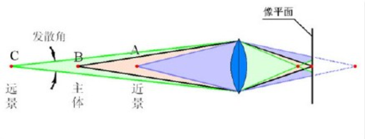
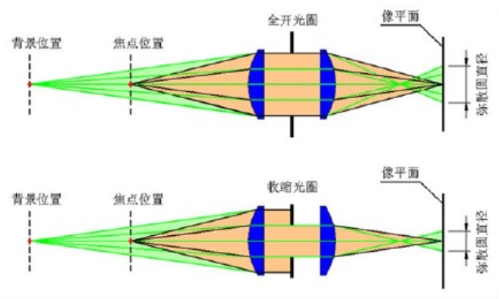
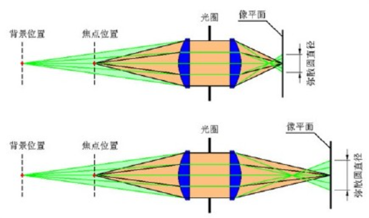

##  一、摄影中的快门、光圈、ISO
### 快门

快门是相机里用来控制曝光时间的装置，就比如一个小黑屋有一扇窗，你打算让阳光多长时间可以透过窗照进来，这就是快门的作用。

我们知道相机曝光的过程，就是相机拾取画面进行拍摄的过程，说白了就是要定格那时那刻所拍摄的画面成为照片。

  

  而快门是控制曝光时间的，如果快门很快，瞬间就定格了画面，不会出现模糊的情况；快门慢，曝光时间长，相机就会把运动物体的轨迹保留在画面中，照片自然就模糊了。

  

  那快门到底怎么合理调整从而保证画面不模糊？对啦，相机是有个“安全快门速度”的：在使用全画幅相机（135相机）拍摄时，安全速度是焦距的倒数，也就是说，拍照时你快门的速度不得低于1/35秒，不然手持相机拍摄时很容易让照片模糊。

  

  当然，“安全快门速度”是个相对参考值，只要记住，快门速度越快，产生手震导致画面模糊的几率就越小！如果你是要进行光轨等艺术创作，那就要准备三脚架了。

### 光圈

很多人不理解光圈到底怎么回事，其实光圈是由镜头内若干金属薄片构成的一个可调节大小的圆孔，我们通过调节这些光圈圆孔的大小来控制到达相机感光元件的光量。

  

说白了就是我们通过这个光圈圆孔的大小决定让多少光线可以进入相机。

  

我们知道，所有相机都是利用小孔成像的原理，而相机的光圈就相当于带有小孔的纸板，墙面就相当于感光元件，不同的是相机的这个小孔是可以改变大小的，也就是我们说的调节光圈的大小。

  

如你所知，光圈大小是用“f/数值”来表示的，“f/”后面的数值越小，代表其光圈越大，数值越大，代表其光圈越小。如f/4的光圈就要比f/8的光圈大。

  

别问光圈F值怎么来，这是有一个计算公式的：光圈F值=镜头的焦距/镜头光圈的直径，不知道你有没有发现，这些光圈值是以1.4倍的关系变化的。

原来，光圈开大一级，要求通过光的面积增加一倍，因为圆形的面积与直径的平方值成正比，也就是说光圈面积就与光圈直径的平方成正比，所以光圈直径就需要增加根号2倍＝1.4倍啦~

  

在其它设置不变的情况下，光圈越大图像就会越亮，因为光圈越大，单位时间内的曝光量就越多，图像自然就会越亮，反之亦然。

  

和快门有安全快门一样，光圈也是有一个最佳值的，在同一款镜头的各挡光圈中，总有一挡光圈的画质呈现是优于其他挡位的，这个最佳光圈一般是镜头光圈级数的中间位置，如f/8、f/11等。

  

 所以说，调整光圈的大小一方面是为了调节画面亮度，另一方面也是为了获得最佳的成像质量。当然，还有很重要的一点就是为了得到虚化背景的艺术效果。

### 感光度 ISO

ISO就是我们常说的感光度，是指感光元件（CCD/CMOS）对光线的敏感程度。ISO数值越高就说明该感光元器件的感光能力越强。

和快门、光圈一样，ISO当然也是有数值等级的，如100，200，400等，而且这个数值也是有计算公式的：ISO=0.8/曝光量。

既然ISO是指感光元件对光的敏感度，那ISO值越高就是指感光元件对光越敏感，相片的亮度就越高，拍摄的画面就噪点很多，颜色失真，细节丢失，画质比较粗糙。反之，ISO值低就是对光不特别敏感，画面就越细腻，表现细节多不会有太多的噪点。

## 二、光圈介绍

光圈对你的照片有一些影响。 其中一个最重要的是亮度，或曝光。光圈通过改变大小，可以改变到达相机传感器的光线总量，从而改变图像的亮度。 在快门和ISO固定情况下，一个大光圈(一个大的开口)会通过大量的光线，从而产生一张更明亮的照片。 小光圈恰恰相反，使照片变暗。

光圈的另一个关键影响是景深。 景深是你的照片从正面到背面呈现出来的锐利程度。 有些图像的景深很“薄”或“浅” ，背景完全失焦。 有的图像有“大”或“深”景深，前景和背景都很清晰。

由凸透镜成像我们可以知道，物距越大，像距越小，物距越小，相距越大，虚化的本质，就是使背景的每一个点在感光平面上呈弥散圆状。弥散圆直径越大，背景的像就越“虚”，所以随着光圈孔径的增加，背景光点弥散圆的直径成比例地增加，虚化程度加强。

改变凸透镜的凸度，就可以改变成像的焦距。焦距越大，则不同发散角的光束折射后形成的焦点间的距离就越大。

  

  